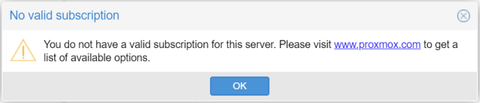

# PVE Nag Remover
> A safe, and scriptable way to remove and restore the Proxmox VE no-subscription popup.


Proxmox VE (PVE) displays a "No valid subscription" nag popup when used without an enterprise subscription. This script cleanly disables that dialog by modifying the appropriate JavaScript file — without breaking the UI or core functionality. It also ensures:
- ✅ Safe, version-aware patching and restoration
- 💾 Automatic backups with optional timestamped versions
- 🔁 Re-application at boot or on a schedule (optional)

👉 [View Latest Release](https://github.com/jordanhillis/pve-nag-remover/releases)

---



---

## ⚙️ Features

- ✅ Removes the "No valid subscription" popup
- 🔁 Reverts using the most recent `.bak` file
- 🧠 Automatically skips if already applied
- 💾 Keeps only the last 3 backups to avoid clutter
- 🔁 Adds or removes frequency of cron job
- 🔄 Automatic self-updating with version check and confirmation
- 🔐 Secure updates with SHA-256 checksum verification

---

## 📥 Installation

You can run `pve-nag-remover` either directly from the downloaded script or install it system-wide.

### 🔹 Option 1: Run directly (no install)

```bash
curl -fsSL https://raw.githubusercontent.com/jordanhillis/pve-nag-remover/main/pve-nag-remover.sh -o pve-nag-remover.sh
chmod +x pve-nag-remover.sh
```

Then run it with:

```bash
sudo ./pve-nag-remover.sh apply
```

---

### 🔹 Option 2: Install system-wide (/usr/local/bin)

```bash
sudo curl -fsSL https://raw.githubusercontent.com/jordanhillis/pve-nag-remover/main/pve-nag-remover.sh -o /usr/local/bin/pve-nag-remover
sudo chmod +x /usr/local/bin/pve-nag-remover
```

Then use it from anywhere with:

```bash
sudo pve-nag-remover apply
```

---

## 🛠 Usage

Whether you installed it or are running it directly, use the following commands:

### 🔧 Patch Control

```bash
sudo pve-nag-remover apply      # Apply patch
sudo pve-nag-remover revert     # Revert patch
```

—or if running directly—

```bash
sudo ./pve-nag-remover.sh apply
sudo ./pve-nag-remover.sh revert
```

---

### ⏱ Auto-run with Cron (optional)

You can have the script run automatically on a schedule using cron. You'll be prompted to choose:

- `@reboot` – Run once at boot
- `Hourly` – Run every hour
- `Daily` – Run once a day
- `Custom` – Enter any valid cron expression

```bash
sudo pve-nag-remover cron-add      # Add cron job (choose frequency interactively)
sudo pve-nag-remover cron-remove   # Remove from cron
sudo pve-nag-remover cron-status   # Check cron presence
```

—or with script file—

```bash
sudo ./pve-nag-remover.sh cron-add
sudo ./pve-nag-remover.sh cron-remove
sudo ./pve-nag-remover.sh cron-status
```

### 📊 Other Commands

```bash
sudo pve-nag-remover status       # Show patch status and backup info
pve-nag-remover --version         # Show version
```

---

## 💡 How It Works

- It locates the `proxmoxlib.js` file in `/usr/share/javascript/proxmox-widget-toolkit/`
- It backs up the original once, then keeps timestamped `.bak` files
- It removes the `Ext.Msg.show()` dialog logic that displays the subscription warning
- It replaces that logic with `void 0` to no-op without breaking functionality
- It restarts `pveproxy.service` to apply changes immediately

---

## 🔄 Auto-Update

The script checks for updates hourly (on each run) and offers to upgrade itself automatically.
You can disable version checking by editing the script and setting:
```bash
DISABLE_VERSION_CHECK=true
```
--- 

## 🔐 Security & Verification

When updating, `pve-nag-remover` automatically verifies the integrity of the downloaded script using a SHA-256 checksum.

Each release includes:
- `pve-nag-remover.sh` — the actual script
- `pve-nag-remover.sh.sha256` — SHA-256 hash for verification

This ensures:
- You are running the official version
- The update has not been tampered with
- The script was downloaded correctly

To verify manually:

```bash
curl -fsSL https://raw.githubusercontent.com/jordanhillis/pve-nag-remover/main/pve-nag-remover.sh -o pve-nag-remover.sh
curl -fsSL https://raw.githubusercontent.com/jordanhillis/pve-nag-remover/main/pve-nag-remover.sh.sha256 -o pve-nag-remover.sh.sha256
sha256sum -c pve-nag-remover.sh.sha256
```

If the output says `OK`, you're good to go ✅

---

## 🧼 Backup Logic

- If a backup already exists, a timestamped `.bak` is created
- Only the **latest 3 timestamped backups** are kept
- The `revert` operation uses the **most recent available backup**

---

## 🧪 Example Output

```text
ℹ Detected Proxmox version: pve-manager/7.4-15/...
✔ Backup created: /usr/share/.../proxmoxlib.js.bak
✔ Proxmox subscription nag successfully removed.
✔ Restarted pveproxy.service
```

---

## 📎 Requirements

- Proxmox VE 5.1 or newer
- Bash 4+
- Root privileges (`sudo`)

---

## ❓ FAQ

Looking for more answers?

👉 Check out the [Full FAQ on GitHub Wiki »](https://github.com/jordanhillis/pve-nag-remover/wiki/FAQ)

---

## ⚠️ Disclaimer

Use at your own risk. This script modifies core Proxmox UI files and may be overwritten by updates. While safe to revert, always review the source before use.

---

## 📄 License

[MIT](/LICENSE) — free to use, modify, and distribute.

---

## 🧠 Author

Created by [Jordan Hillis](https://github.com/jordanhillis). Contributions welcome!
